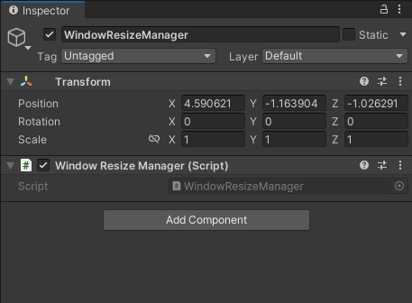
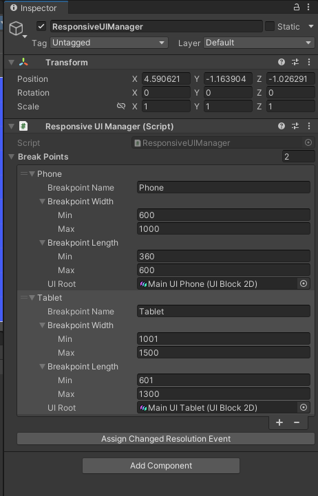

# How to use
So all that you will need to do to use this is to create 2 new game objects. 
 
One that has the component ResponsiveUIManager 
 
And the other has the component WindowResizeManager 
 

Window Resize Manager:
 

 
Responsive UI Manager: 
 

 
In Responsive UI Manager, 
 
Define your breakpoint viewports. 
 

Make sure to assign event by clicking on Assign Changed Resolution Event!
 
If you don't, it wont work.
 
If it doesnt work for any reason try assigning event again. should fix!
